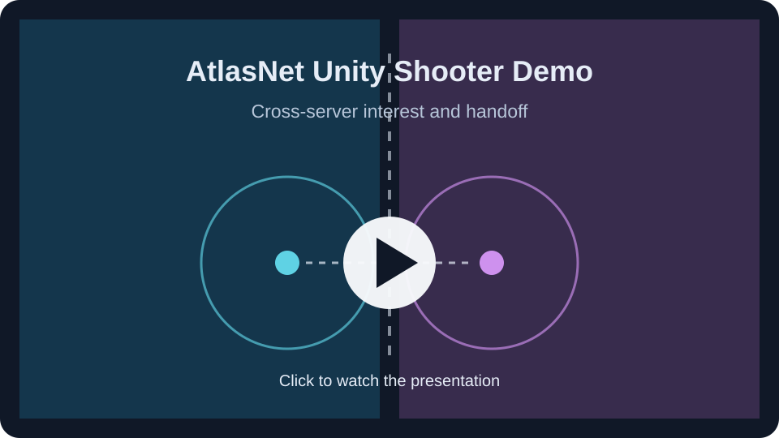

# AtlasNet Unity Shooter Demo

Unity project for comparing the shooter sample's AtlasNet client- and server-authoritative players, including cross-server handoff scenes.

## Presentation

[Watch the full presentation on YouTube](https://youtu.be/4-gM8oYjoGM).

download this repo as zip and extract

Open the project in Unity 6000.6.2f1 or newer

Scenes in `Assets/Scenes`:

- `ClientAuth` and `ServerAuth` are the single-worker comparisons.
- `ClientCrossServer` and `ServerCrossServer` exercise local multi-worker interest and handoff. In Multiplayer Play Mode, use the same scene in each instance and start a Host, then a Worker, then a Client.

The imported Low Poly Shooter Pack - Free Sample assets are under Assets/Infima Games. They are third-party content used as the shooter example to network and use the deprecated built-in render pipeline;